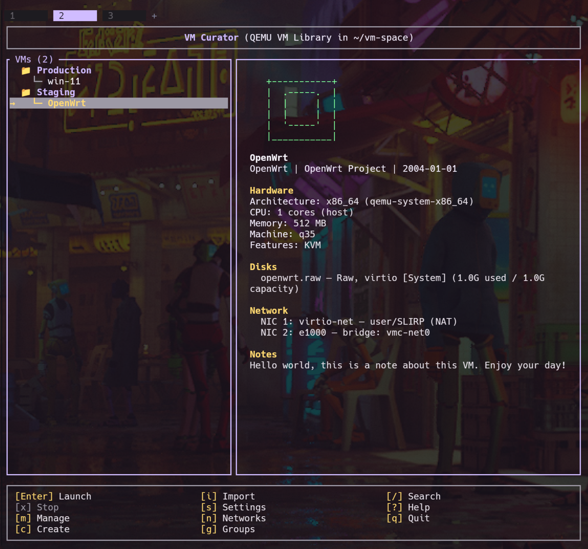

# vm-curator

A fast and friendly Rust TUI for managing desktop QEMU/KVM virtual machines — with 3D acceleration, GPU and physical-disk passthrough, managed virtual networks, multi-NIC VMs, freeform VM groups, VM import, and 130+ pre-configured OS profiles!

See [CHANGELOG.md](CHANGELOG.md) for release notes.



### Features

- **VM Discovery & Organization**: Automatically scans your VM library and organizes VMs by OS family, with search, filtering, and live status.
- **VM Groups**: Organize VMs into freeform, reorderable groups instead of (or alongside) the automatic OS-family hierarchy.
- **VM Import Wizard**: Import existing VMs from libvirt (virsh) XML or Quickemu `.conf` files with a 5-step guided flow.
- **GPU Passthrough**: Single- or multi-GPU passthrough with Looking Glass, PCI device selection, and a VFIO/IOMMU setup wizard.
- **3D Graphics Acceleration**: Para-virtualized 3D acceleration via `virtio-vga-gl`, tested on NVIDIA RTX-4090.
- **Snapshot Management**: Create, restore, and delete qcow2 snapshots with a visual list and background operations.
- **Physical Disk Passthrough**: Pass whole physical disks (NVMe, SATA/HDD, USB) through to guests as raw virtio-blk devices.
- **Network Configuration**: Multi-NIC VMs, per-adapter backend selection, bridge networking, and a built-in virtual network manager.
- **Shared Folders**: Share host directories with VMs using virtio-9p, managed from the management menu.
- **Clipboard Sharing (SPICE)**: Bidirectional host ⇄ guest copy/paste when using the `spice-app` display backend.
- **USB Passthrough**: Pass through up to 16 USB devices via an emulated xHCI controller, with persistent configuration.
- **Launch Script Editor**: Edit `launch.sh` directly in the TUI, with automatic re-parsing after saves.
- **Additional Features**: Vim-style navigation, multiple boot modes, headless VM support, and other quality-of-life touches.

### Installation

**AUR (Arch / Arch-derived)**

```bash
# Using your preferred AUR helper
paru -S vm-curator
yay -S vm-curator
```

**Homebrew (Linux, incl. atomic distros like Bluefin/Silverblue)**

```bash
brew install mroboff/tap/vm-curator
```

Installs the prebuilt x86_64 binary from [the tap](https://github.com/mroboff/homebrew-tap); QEMU itself is not bundled (see `brew info vm-curator`).

**crates.io**

```bash
cargo install vm-curator
```

**Binary Packages**

Pre-built packages (DEB, RPM, AppImage, tarball) are available from [GitHub Releases](https://github.com/mroboff/vm-curator/releases).

**Nix / NixOS**

```bash
# Run directly without installing
nix run github:mroboff/vm-curator

# Build the package
nix build .#default
```

For NixOS, add to `/etc/nixos/configuration.nix`:
```nix
{ pkgs, ... }:
{
  environment.systemPackages = [ pkgs.vm-curator ];
}
```

**From Source**

```bash
git clone https://github.com/mroboff/vm-curator.git
cd vm-curator
cargo build --release
```

The binary will be at `target/release/vm-curator`.

**Prerequisites**
- **Required**: QEMU (`qemu-system-*` binaries), qemu-img (for disk creation and snapshots), libudev
- **Build**: a recent Rust stable toolchain (see `rust-toolchain.toml`), libudev-dev (Debian/Ubuntu) or systemd-libs (Arch/Fedora)
- **Optional**:
  - OVMF/edk2 — UEFI boot support (`edk2-ovmf` on Arch, `ovmf` on Debian/Ubuntu)
  - swtpm — TPM 2.0 emulation (required for Windows 11 VMs)
  - virt-viewer — SPICE-app display backend
  - passt — passt network backend
  - dnsmasq — DHCP for managed virtual networks (nftables or iptables for NAT/isolation)
  - Looking Glass client — multi-GPU passthrough display
  - polkit — bridge networking permissions

### Usage

#### TUI Mode (default)

```bash
vm-curator
```

#### CLI Commands

```bash
# List all VMs
vm-curator list

# Launch a VM
vm-curator launch windows-95
vm-curator launch windows-95 --install    # Boot in install mode
vm-curator launch windows-95 --cdrom /path/to/image.iso

# View VM configuration
vm-curator info windows-95

# Import a VM
vm-curator  # then press 'i' for the import wizard

# Manage snapshots
vm-curator snapshot windows-95 list
vm-curator snapshot windows-95 create my-snapshot
vm-curator snapshot windows-95 restore my-snapshot
vm-curator snapshot windows-95 delete my-snapshot

# List available QEMU emulators
vm-curator emulators
```

### Key Bindings

#### Main Menu

| Key | Action |
|-----|--------|
| `j/k` or `Down/Up` | Navigate VM list |
| `Enter` | Launch selected VM |
| `m` | Open management menu |
| `x` | Stop VM (if running) |
| `c` | Open VM creation wizard |
| `i` | Open VM import wizard |
| `s` | Open settings |
| `n` | Virtual Network Manager |
| `g` | Manage VM Groups |
| `/` | Search/filter VMs |
| `?` | Show help |
| `PgUp/PgDn` | Scroll info panel |
| `Esc` | Back / Cancel |
| `q` | Quit |

#### VM Management

| Key | Action |
|-----|--------|
| `j/k` or `Down/Up` | Navigate menu |
| `Enter` | Select menu option |
| `1`–`9` | Jump directly to a menu option |
| `Esc` | Back |

Management menu options:
- Boot Options (normal, install, custom ISO)
- Snapshots
- USB Passthrough
- PCI Passthrough
- Passthrough Disks (whole physical disks)
- Shared Folders
- Network Settings
- Multi-GPU Passthrough (if enabled)
- Single GPU Passthrough (if enabled)
- Change Display
- 3D Acceleration toggle
- Edit Notes
- Rename VM
- Stop VM
- Reset VM (recreate disk)
- Delete VM
- Edit Raw Configuration

#### Create Wizard

| Key | Action |
|-----|--------|
| `j/k` or `Down/Up` | Navigate fields |
| `←/→` | Adjust / toggle the focused field |
| `Tab` | Edit the focused value as text (where supported) |
| `Enter` | Continue to next step |
| `Esc` | Previous step / cancel |

### Configuration

Settings are stored in `~/.config/vm-curator/config.toml` and can be edited via the Settings screen (`s` key).

```toml
# VM library location
vm_library_path = "~/vm-space"

# Default values for new VMs
default_memory_mb = 4096
default_cpu_cores = 2
default_disk_size_gb = 64
default_display = "gtk"      # gtk, sdl, spice-app, vnc
default_enable_kvm = true
# default_iso_path = "/path/to/isos"   # Directory the ISO browser opens in (omit = home)
# default_window_size = "1440x900"     # Initial VM window size (omit = VM default)

# Behavior
confirm_before_launch = true

# Multi-GPU passthrough (Looking Glass)
enable_multi_gpu_passthrough = false
default_ivshmem_size_mb = 64
show_gpu_warnings = true
looking_glass_client_path = ""       # Path to Looking Glass client
looking_glass_auto_launch = true     # Auto-launch client when VM starts

# Single GPU passthrough
single_gpu_enabled = false
single_gpu_auto_tty = false          # Experimental: auto switch TTY
single_gpu_dm_override = ""          # Override display manager detection
```

### VM Library Structure

VMs are expected in your library directory (default `~/vm-space/`) with this structure:

```
~/vm-space/
├── windows-95/
│   ├── launch.sh      # QEMU launch script (required)
│   └── disk.qcow2     # Disk image (qcow2 recommended for snapshots)
├── linux-debian/
│   ├── launch.sh
│   ├── disk.qcow2
│   └── install.iso    # Optional: installation media
└── macos-tiger/
    ├── launch.sh
    └── disk.qcow2
```

The `launch.sh` script should invoke QEMU. VM Curator parses this script to extract configuration and can generate new scripts via the creation wizard.

### OS Profiles

The creation wizard includes 130+ pre-configured profiles organized into 16 OS families:

**Microsoft**: DOS, Windows 1.x–3.x, Windows 95/98/ME, Windows NT/2000/XP/Vista, Windows 7/8/10/11, Server editions

**Apple**: Classic Mac OS (System 6–9), Mac OS X PowerPC (Cheetah–Tiger), Mac OS X Intel (Leopard–El Capitan), macOS (Sierra–Tahoe)

**Linux**: Arch, Manjaro, EndeavourOS, Garuda, CachyOS, Debian, Ubuntu, Mint, Pop!_OS, Fedora, RHEL, Rocky, Alma, Bazzite, openSUSE, Slackware, Gentoo, Void, NixOS, Alpine, and more

**BSD**: FreeBSD, GhostBSD, OpenBSD, NetBSD, DragonFly BSD

**Unix**: Solaris, OpenIndiana, illumos, HP-UX, IRIX, MINIX, QNX

**IBM**: OS/2, eComStation, ArcaOS, AIX

**Commodore**: AmigaOS, AROS, MorphOS

**Be / Haiku**: BeOS, Haiku

**NeXT**: NeXTSTEP, OpenStep

**Research**: Plan 9, 9front, Inferno

**Alternative**: SerenityOS, Redox, TempleOS, KolibriOS, MenuetOS, ReactOS

**Retro**: Atari TOS, CP/M, FreeDOS, DR-DOS, GEOS, RISC OS

**Mobile**: Android-x86, LineageOS, Bliss OS

**Infrastructure**: pfSense, OPNsense, OpenWrt, TrueNAS, Proxmox, ESXi

**Utilities**: GParted, Clonezilla, Memtest86+

**Other**: Catch-all for uncategorized VMs

Each profile includes optimal QEMU settings for that OS (emulator, machine type, CPU model, VGA, audio, network, disk interface, and more).

### Metadata Customization

**OS Information**: Override or add OS metadata in `~/.config/vm-curator/metadata/`:

```toml
# ~/.config/vm-curator/metadata/my-os.toml
[my-custom-os]
name = "My Custom OS"
publisher = "My Company"
release_date = "2024-01-01"
architecture = "x86_64"

[my-custom-os.blurb]
short = "A brief description"
long = "A longer description with history and details."

[my-custom-os.fun_facts]
facts = ["Fact 1", "Fact 2"]
```

**ASCII Art**: Add custom ASCII art in `~/.config/vm-curator/ascii/`.

**QEMU Profiles**: Override profiles in `~/.config/vm-curator/qemu_profiles.toml`.

### Dependencies

- **Runtime**: QEMU, qemu-img, libudev
- **Build**: a recent Rust stable toolchain (see `rust-toolchain.toml`), libudev-dev (Debian/Ubuntu) or systemd-libs (Arch)
- **Optional**: OVMF/edk2 (UEFI), swtpm (Windows 11 TPM), virt-viewer (SPICE-app), passt (networking), dnsmasq + nftables/iptables (managed virtual networks), Looking Glass client (multi-GPU), polkit (bridge networking)

### Cross-Distribution Compatibility

VM Curator automatically detects OVMF/UEFI firmware as matched CODE+VARS pairs (preferring 4M builds, including Fedora's qcow2-format firmware) across Linux distributions:
- Arch Linux: `/usr/share/edk2/x64/OVMF_CODE.4m.fd`
- Debian/Ubuntu: `/usr/share/OVMF/OVMF_CODE_4M.fd`
- Fedora/RHEL: `/usr/share/edk2/ovmf/OVMF_CODE_4M.qcow2`
- NixOS: Multiple search paths supported
- And more...

---

### Contributing

Contributions are welcome! If you find a bug or have an idea for an improvement, feel free to open an issue or submit a Pull Request.

**Help Wanted: ASCII Art**
As a TUI application, `vm-curator` relies on visual flair to stand out. I am specifically looking for help with:
* **Logo/Banner Art:** A cool ASCII banner for the startup screen.
* **Iconography:** Small, recognizable ASCII/block character icons for the TUI menus (e.g., stylized hard drives, network cards, or GPU icons).

If you have a knack for terminal aesthetics, your PRs are highly appreciated!

### Support & Maintenance Status

**`vm-curator`** was built to solve a specific, painful problem: getting high-performance, 3D-accelerated Linux VMs (via QEMU) without the overhead and complexity of `libvirt` or `virt-manager`.

This is a **personal passion project** that I am sharing with the community. While I use this tool daily and will fix critical bugs as I encounter them, please note:

* **Development Pace:** This project is maintained in my spare time. Feature requests will be considered but are not guaranteed.
* **The "As-Is" Philosophy:** The goal is a lean, transparent TUI. I prioritize stability and performance over comprehensive enterprise feature parity.

**If this tool saved you time or helped you get 3D Acceleration working without having to resort to passthrough:**

If you'd like to say thanks, you can support the project below. **Donations are a "thank you" for existing work, not a payment for future support.**

* **[GitHub Sponsors](https://github.com/sponsors/mroboff):** Best for one-time contributions (Goes to the RTX-Pro 6000 fund!)
* **[Ko-fi](https://ko-fi.com/mroboff):** Buy me a coffee (or a generic energy drink).

---

### License

MIT
